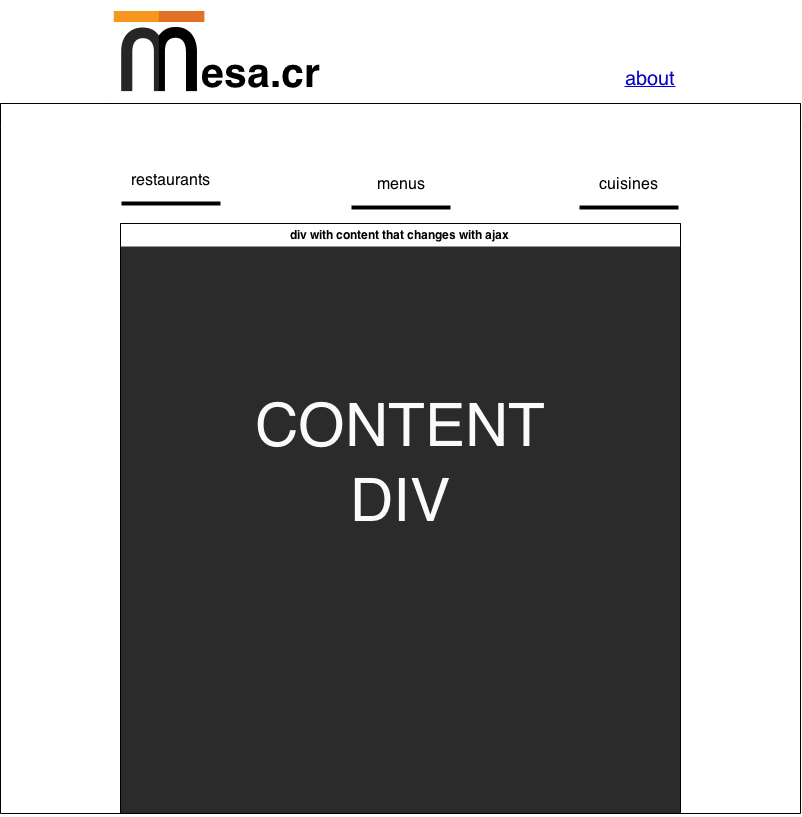
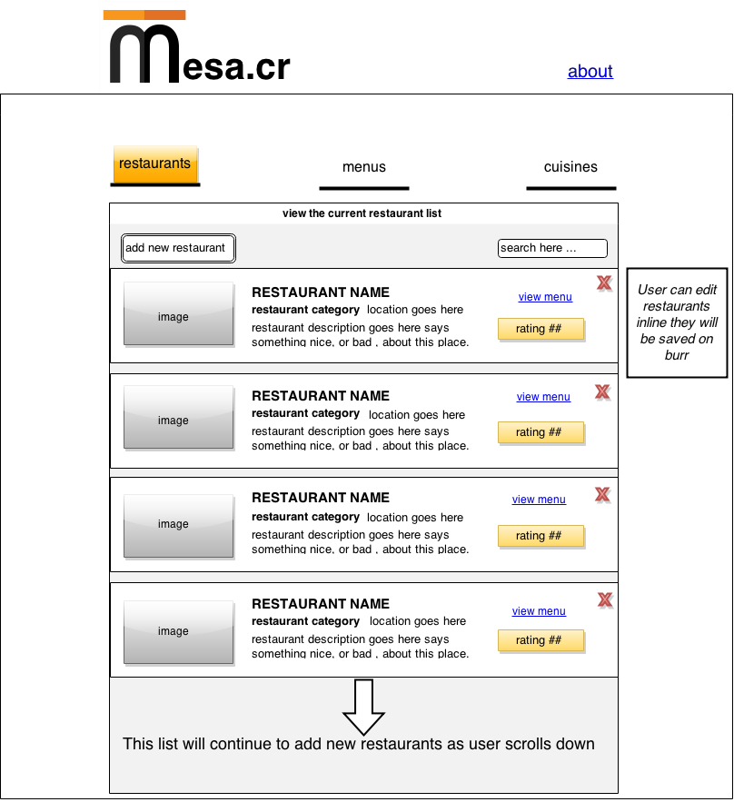
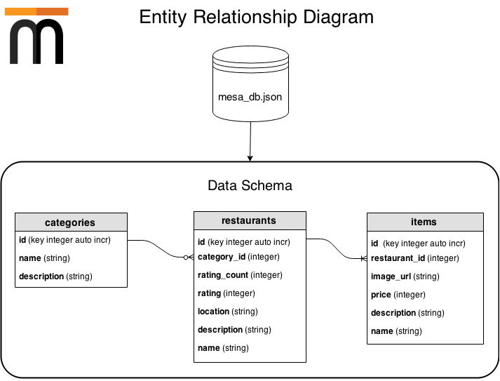

#mesa.cr

A culinary guide of Costa Rica

live demo URL: http://xavierf.software:3000

##Project Description

Mesa is a single page APP developed to keep track of restaurants, their cuisine types, and menu items.

## Wireframes

* As a user be able to create, read, update, and delete categories.
* As a user be able to create, read, update, and delete restaurants.
* As a user  be able to create, read, update, and delete menu items.
* As a user be able to organize items by their restaurant (so an item should only belong to one menu).

### View all Restaurants

## Database ERD

restaurants-layout.png
## APIs or libraries
## Project dependencies
APIs and libraries.

### Backend

####json-server
https://github.com/typicode/json-server
version 0.7.2

### Frontend
makes the  app "shine" visually.

####Mustache
https://mustache.github.io/
version 2.0.0

####Semantic UI
http://semantic-ui.com/
version 1.12.1
Makes the application responsive so that it is viewable on a mobile phone.

####jQuery
http://jquery.com/
version 1.8

#### Flatiron Director
https://github.com/flatiron/director
Client side routing

####animate.css
http://daneden.github.io/animate.css/

## Instructions for downloading the code and running it

create a symbolic link to bower components within the public folder

`ln -s ../bower_components/ bower_components`
